# 🪙 Coin Community Backend

> **암호화폐 커뮤니티 플랫폼 - Spring Boot 백엔드**

[](https://spring.io/projects/spring-boot)
[](https://www.oracle.com/java/technologies/javase-jdk17-downloads.html)
[](https://www.mysql.com/)
[](https://redis.io/)
[](https://stomp.github.io/)
[](https://swagger.io/)
[](https://www.docker.com/)
[](https://github.com/features/actions)

## 📋 프로젝트 개요

**Coin Community Backend**는 암호화폐 투자자들을 위한 종합 커뮤니티 플랫폼의 백엔드 시스템입니다. 실시간 가격 정보, 포트폴리오 관리, 김치프리미엄 모니터링, 커뮤니티 기능을 제공하는 엔터프라이즈급 Spring Boot 애플리케이션입니다.

이 프로젝트는 최신 Java 및 Spring 기술 스택을 활용하여 확장 가능하고 안정적인 백엔드 시스템을 구현했으며, 대용량 트래픽과 실시간 데이터 처리를 위한 최적화된 아키텍처를 갖추고 있습니다.

### 🎯 핵심 특징

- **🔄 실시간 데이터**: WebSocket 기반 실시간 가격 정보 및 알림
- **📊 다중 거래소 연동**: 5개 국내외 거래소 API 통합 (업비트, 빗썸, 코인원, 코빗, CoinGecko)
- **💰 김치프리미엄 모니터링**: 국내외 가격 차익 실시간 계산 및 알림
- **📈 포트폴리오 관리**: 완전한 CRUD와 수익률 분석
- **🔍 코인 분석 시스템**: AI 기반 예측 및 투자 추천
- **👥 커뮤니티 기능**: 게시글, 댓글, 좋아요, 실시간 채팅
- **🔐 보안**: JWT 기반 인증/인가, Spring Security 적용
- **⚡ 성능 최적화**: Redis 캐싱, 배치 처리, 비동기 처리

## 🏗️ 시스템 아키텍처

```
┌─────────────────┐    ┌─────────────────┐    ┌─────────────────┐
│   Client Apps   │    │  External APIs  │    │  Push Services  │
│  React/Mobile   │    │ Upbit/Bithumb   │    │      FCM        │
└─────────┬───────┘    └─────────┬───────┘    └─────────┬───────┘
          │                      │                      │
          ▼                      ▼                      ▼
┌─────────────────────────────────────────────────────────────────┐
│                    API Gateway (Spring Boot)                    │
├─────────────────────────────────────────────────────────────────┤
│  JWT Auth  │  CORS   │  Rate Limiting  │  Request Validation   │
└─────────┬───────────────────────────────────────────────────────┘
          │
┌─────────▼───────────────────────────────────────────────────────┐
│                      Controller Layer                          │
├─────────────────────────────────────────────────────────────────┤
│ Portfolio │ Analysis │ Community │ Price │ Notification │ Auth │
└─────────┬───────────────────────────────────────────────────────┘
          │
┌─────────▼───────────────────────────────────────────────────────┐
│                       Service Layer                            │
├─────────────────────────────────────────────────────────────────┤
│ Business Logic │ Cache Management │ External API Integration    │
└─────────┬───────────────────────────────────────────────────────┘
          │
┌─────────▼───────────────────────────────────────────────────────┐
│                    Data Access Layer                           │
├─────────────────────────────────────────────────────────────────┤
│      JPA/Hibernate      │      Redis Cache      │   Scheduler   │
└─────────┬──────────────────────────┬─────────────────────┬──────┘
          │                          │                     │
┌─────────▼───────┐    ┌─────────────▼──────┐    ┌─────────▼──────┐
│  MySQL Database │    │   Redis Cluster    │    │  WebSocket Hub │
│   Master/Slave  │    │  Cache & Session   │    │  Real-time I/O │
└─────────────────┘    └────────────────────┘    └────────────────┘
```

## 📊 데이터베이스 ERD

```mermaid
erDiagram
    User ||--o{ Post : writes
    User ||--o{ Comment : writes
    User ||--o{ PostLike : creates
    User ||--o{ CommentLike : creates
    User ||--o{ UserScore : has
    User ||--o{ Portfolio : owns
    User ||--o{ Transaction : makes
    User ||--o{ CoinWatchlist : manages
    User ||--o{ Notification : receives
    User ||--o{ NotificationPreference : has
    User ||--o{ PriceAlert : sets
    User ||--o{ AnalysisLike : creates
    User ||--o{ NotificationStats : has

    Post ||--o{ Comment : has
    Post ||--o{ PostLike : has
    Post }|--|| PostCategory : belongs_to

    Portfolio ||--o{ PortfolioItem : contains

    CoinAnalysis ||--o{ AnalysisLike : has

    User {
        Long id PK
        String email
        String password
        String nickname
        String profileImage
        String role
        String status
        DateTime createdAt
        DateTime updatedAt
    }

    Post {
        Long id PK
        String title
        String content
        Long userId FK
        Long categoryId FK
        Integer viewCount
        DateTime createdAt
        DateTime updatedAt
    }

    Comment {
        Long id PK
        String content
        DateTime createdAt
        DateTime updatedAt
        Long userId FK
        Long postId FK
    }

    PostLike {
        Long userId FK
        Long postId FK
        DateTime createdAt
    }

    CommentLike {
        Long userId FK
        Long commentId FK
        DateTime createdAt
    }

    UserScore {
        Long userId FK
        Integer score
        Integer level
        DateTime updatedAt
    }

    Portfolio {
        Long id PK
        String name
        String description
        Long userId FK
        DateTime createdAt
        DateTime updatedAt
    }

    PortfolioItem {
        Long id PK
        Long portfolioId FK
        String coinSymbol
        BigDecimal amount
        BigDecimal purchasePrice
        DateTime createdAt
        DateTime updatedAt
    }

    Transaction {
        Long id PK
        Long userId FK
        String coinSymbol
        String type
        BigDecimal amount
        BigDecimal price
        String exchangeId
        DateTime createdAt
    }

    CoinWatchlist {
        Long id PK
        Long userId FK
        String coinSymbol
        DateTime createdAt
    }

    CoinPrice {
        Long id PK
        String symbol
        String name
        BigDecimal price
        String exchangeId
        DateTime updatedAt
    }

    CoinAnalysis {
        Long id PK
        String coinSymbol
        String analysis
        String sentiment
        String prediction
        DateTime createdAt
        DateTime updatedAt
    }

    AnalysisLike {
        Long userId FK
        Long analysisId FK
        DateTime createdAt
    }

    Notification {
        Long id PK
        Long userId FK
        String message
        String type
        Boolean isRead
        DateTime createdAt
    }

    NotificationPreference {
        Long id PK
        Long userId FK
        Boolean priceAlerts
        Boolean communityNotifs
        Boolean newsNotifs
        DateTime updatedAt
    }

    PriceAlert {
        Long id PK
        Long userId FK
        String coinSymbol
        BigDecimal targetPrice
        String condition
        Boolean isActive
        DateTime createdAt
    }

    News {
        Long id PK
        String title
        String content
        String source
        String imageUrl
        DateTime publishedAt
        DateTime createdAt
    }

    NotificationStats {
        Long userId FK
        Integer totalCount
        Integer readCount
        DateTime lastUpdated
    }

    PostCategory {
        Long id PK
        String name
        String description
        Long parentId FK
        DateTime createdAt
    }
```



## 🔑 주요 엔티티 설명

### 👤 사용자 및 인증

- **User**: 사용자 기본 정보 및 인증 데이터
- **UserRole**: 사용자 권한(ADMIN, USER 등)
- **UserScore**: 사용자 활동 점수 및 레벨
- **UserStatus**: 계정 상태(ACTIVE, SUSPENDED 등)

### 💰 포트폴리오 관리

- **Portfolio**: 사용자 포트폴리오 정보
- **PortfolioItem**: 포트폴리오 내 개별 코인 보유 정보
- **Transaction**: 거래 내역(매수/매도)
- **CoinWatchlist**: 사용자별 관심 코인 목록

### 📈 코인 데이터

- **CoinPrice**: 코인별 실시간 가격 정보
- **CoinPriceId**: 코인 가격 복합 키(코인+거래소)
- **CoinAnalysis**: 코인별 분석 및 예측 정보

### 🗣️ 커뮤니티

- **Post**: 게시글 정보
- **PostCategory**: 게시글 카테고리
- **Comment**: 게시글에 대한 댓글
- **PostLike**: 게시글 좋아요
- **CommentLike**: 댓글 좋아요
- **AnalysisLike**: 분석 글 좋아요
- **AnalysisBookmark**: 분석 글 북마크

### 📰 뉴스 및 알림

- **News**: 암호화폐 관련 뉴스
- **Notification**: 사용자별 알림 메시지
- **NotificationPreference**: 알림 설정
- **NotificationSettings**: 알림 세부 설정
- **NotificationStats**: 알림 통계
- **PriceAlert**: 가격 알림 설정

모든 엔티티는 생성 및 수정 시간을 추적하는 **BaseTimeEntity**를 상속받아 Auditing 기능을 제공합니다.

## 🏛️ 아키텍처 및 기술 구현

### 📐 계층 구조

이 프로젝트는 전통적인 Spring Boot 애플리케이션의 계층 구조를 따릅니다:

```
Controller → Service → Repository → Database
```

각 계층은 명확한 책임을 가지며, 관심사 분리를 통해 유지보수성과 테스트 용이성을 높였습니다.

### 🧩 거래소 연동 패턴

거래소별 API 연동을 위해 전략 패턴을 적용했습니다. 이를 통해 거래소가 추가되더라도 기존 코드 변경 없이 확장이 가능합니다.

```
┌───────────────────────┐
│ ExchangeApiStrategy   │◄─────────────────┐
│    (Interface)        │                  │
└───────────┬───────────┘                  │
            │                              │
            │ implements                   │
            ▼                              │
┌─────────────────────────────────────┐    │    ┌─────────────────────────┐
│                                     │    │    │                         │
│  ┌─────────────┐  ┌─────────────┐   │    │    │     Strategy Context    │
│  │업비트 API    │  │빗썸 API      │   │    │    │                         │
│  └─────────────┘  └─────────────┘   │    │    └──────────────┬──────────┘
│                                     │    │                   │
│  ┌─────────────┐  ┌─────────────┐   │    │                   │ uses
│  │코인원 API    │  │코빗 API      │   │    │                   │
│  └─────────────┘  └─────────────┘   │    │                   ▼
│                                     │    │    ┌─────────────────────────┐
│  ┌─────────────┐  ┌─────────────┐   │    └────┤  Strategy Factory       │
│  │바이낸스 API   │  │코인게코 API   │         │                         │
│  └─────────────┘  └─────────────┘   │         └─────────────────────────┘
│                                     │
└─────────────────────────────────────┘
```

구현 특징:

- 거래소 API 인터페이스 추상화
- 팩토리 클래스를 통한 적절한 거래소 API 클라이언트 제공
- 런타임에 전략 교체 가능

### 📡 거래소 통합 시스템

```
┌──────────────────────────────────────────────────────┐
│                  거래소 API 통합 레이어                │
├──────────────────────────────────────────────────────┤
│  ┌─────────────┐   ┌─────────────┐   ┌─────────────┐ │
│  │ 가격 정보    │   │  주문 처리   │   │ 마켓 정보   │ │
│  └──────┬──────┘   └──────┬──────┘   └──────┬──────┘ │
│         └─────────────────┼─────────────────┘        │
│                           │                          │
│                   전략 컨텍스트/팩토리                  │
└──────────────────────────┬┬───────────────────────────┘
                           ││
        ┌─────────────────┘└──────────────────┐
        │                                     │
┌───────▼───────────┐               ┌─────────▼─────────┐
│   국내 거래소      │               │   해외 거래소      │
├───────────────────┤               ├───────────────────┤
│ - 업비트          │               │ - 바이낸스         │
│ - 빗썸           │               │ - 코인게코         │
│ - 코인원          │               │                   │
│ - 코빗           │               │                   │
└───────────────────┘               └───────────────────┘
```

### 📊 김치프리미엄 계산 로직

국내 거래소와 해외 거래소 간 가격 차이를 실시간으로 모니터링합니다:

- 계산식: `(국내가격평균 - 해외가격평균) / 해외가격평균 * 100`
- 프리미엄 변동에 따른 알림 기능
- 거래소별 가격 차트 비교 시각화

### 🔄 실시간 데이터 처리 흐름

```
수집 → 가공 → 캐싱 → 분석 → 이벤트 발행 → 알림/저장
```

## 💻 사용 기술

### 백엔드 프레임워크

- Spring Boot 3.2.0
- Spring Data JPA
- Spring Security
- Spring WebSocket
- Spring Cache

### 데이터베이스

- MySQL 8.0 (메인 DB)
- Redis (캐싱, 세션)
- MongoDB (시계열 데이터)

### 개발 도구

- Gradle
- Docker
- GitHub Actions
- JUnit 5 + Mockito

## 🚀 성능 최적화

### 캐싱 전략

- 다단계 캐싱 (앱 내 캐시 → Redis → DB)
- 거래소 API 호출 최소화를 위한 캐싱
- 이벤트 기반 캐시 무효화

### 비동기 처리

- 병렬 API 호출로 응답 시간 단축
- 비동기 이벤트 기반 알림 처리
- 대용량 데이터 처리를 위한 배치 작업

### DB 최적화

- 주요 쿼리 인덱싱
- 대용량 데이터 파티셔닝
- 읽기/쓰기 분리

## 📑 API 문서

Swagger UI를 통해 API 문서를 확인할 수 있습니다:

- 개발 환경: `http://localhost:8080/swagger-ui.html`

## 🛡️ 보안

- JWT 인증 (Access + Refresh 토큰)
- 역할 기반 접근 제어
- API 요청 제한
- 암호화 처리 (비밀번호, 민감 정보)
