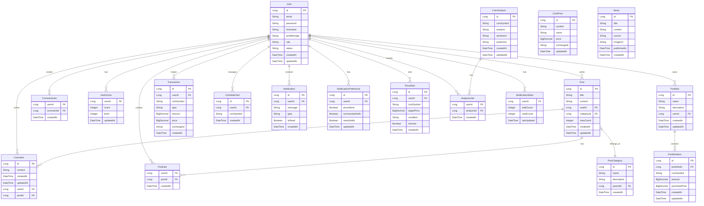

```mermaid
erDiagram
    User ||--o{ Post : writes
    User ||--o{ Comment : writes
    User ||--o{ PostLike : creates
    User ||--o{ CommentLike : creates
    User ||--o{ UserScore : has
    User ||--o{ Portfolio : owns
    User ||--o{ Transaction : makes
    User ||--o{ CoinWatchlist : manages
    User ||--o{ Notification : receives
    User ||--o{ NotificationPreference : has
    User ||--o{ PriceAlert : sets
    User ||--o{ AnalysisLike : creates
    User ||--o{ NotificationStats : has

    Post ||--o{ Comment : has
    Post ||--o{ PostLike : has
    Post }|--|| PostCategory : belongs_to

    Portfolio ||--o{ PortfolioItem : contains

    CoinAnalysis ||--o{ AnalysisLike : has

    User {
        Long id PK
        String email
        String password
        String nickname
        String profileImage
        String role
        String status
        DateTime createdAt
        DateTime updatedAt
    }

    Post {
        Long id PK
        String title
        String content
        Long userId FK
        Long categoryId FK
        Integer viewCount
        DateTime createdAt
        DateTime updatedAt
    }

    Comment {
        Long id PK
        String content
        DateTime createdAt
        DateTime updatedAt
        Long userId FK
        Long postId FK
    }

    PostLike {
        Long userId FK
        Long postId FK
        DateTime createdAt
    }

    CommentLike {
        Long userId FK
        Long commentId FK
        DateTime createdAt
    }

    UserScore {
        Long userId FK
        Integer score
        Integer level
        DateTime updatedAt
    }

    Portfolio {
        Long id PK
        String name
        String description
        Long userId FK
        DateTime createdAt
        DateTime updatedAt
    }

    PortfolioItem {
        Long id PK
        Long portfolioId FK
        String coinSymbol
        BigDecimal amount
        BigDecimal purchasePrice
        DateTime createdAt
        DateTime updatedAt
    }

    Transaction {
        Long id PK
        Long userId FK
        String coinSymbol
        String type
        BigDecimal amount
        BigDecimal price
        String exchangeId
        DateTime createdAt
    }

    CoinWatchlist {
        Long id PK
        Long userId FK
        String coinSymbol
        DateTime createdAt
    }

    CoinPrice {
        Long id PK
        String symbol
        String name
        BigDecimal price
        String exchangeId
        DateTime updatedAt
    }

    CoinAnalysis {
        Long id PK
        String coinSymbol
        String analysis
        String sentiment
        String prediction
        DateTime createdAt
        DateTime updatedAt
    }

    AnalysisLike {
        Long userId FK
        Long analysisId FK
        DateTime createdAt
    }

    Notification {
        Long id PK
        Long userId FK
        String message
        String type
        Boolean isRead
        DateTime createdAt
    }

    NotificationPreference {
        Long id PK
        Long userId FK
        Boolean priceAlerts
        Boolean communityNotifs
        Boolean newsNotifs
        DateTime updatedAt
    }

    PriceAlert {
        Long id PK
        Long userId FK
        String coinSymbol
        BigDecimal targetPrice
        String condition
        Boolean isActive
        DateTime createdAt
    }

    News {
        Long id PK
        String title
        String content
        String source
        String imageUrl
        DateTime publishedAt
        DateTime createdAt
    }

    NotificationStats {
        Long userId FK
        Integer totalCount
        Integer readCount
        DateTime lastUpdated
    }

    PostCategory {
        Long id PK
        String name
        String description
        Long parentId FK
        DateTime createdAt
    }
```
